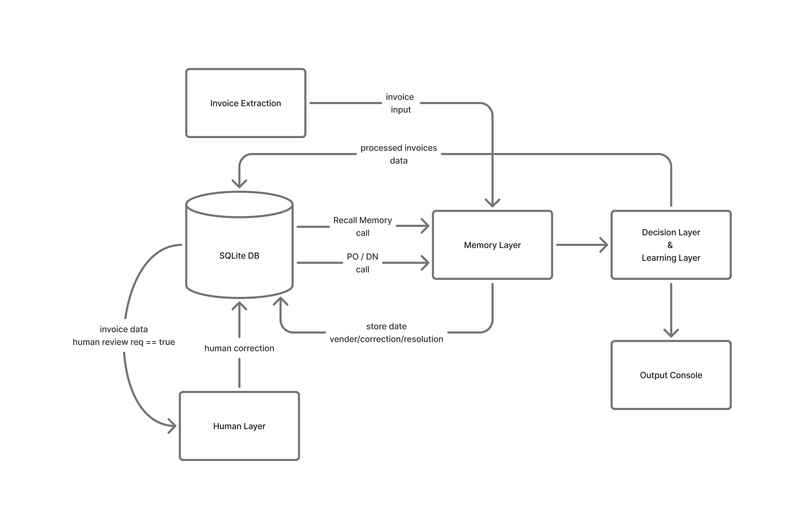

### ☐ Memory Layer for Invoice Automation
This project implements a memory-driven layer on top of invoice extraction Method. It stores and reuses vendor, correction, and resolution memories to improve automation and provide explainable decisions for each invoice.

Video Link - https://drive.google.com/drive/folders/1ATCLxVn9dcDs-DnL0oXUzv3UUcAquOv0?usp=sharing

<p align="center">
  
</p>

### ☐ Tech Stack
- TypeScript (strict-mode)
- Node.js
- SQLite 3

### ☐ Working

`Recall → Apply → Decide → Learn`

#### Learning

1. Input Invoice
- serviceDate, currency, poNumber ? `null`
- Confidence = `0.72`

`data/invoices_extracted.json`

```bash
    { 
      "invoiceId": "INV-A-001", 
      "vendor": "Supplier GmbH", 
      "fields": { 
        "invoiceNumber": "INV-2024-001", 
        "invoiceDate": "12.01.2024", 
        "serviceDate": null, 
        "currency": "EUR", 
        "poNumber": "PO-A-050", 
        "netTotal": 2500.0, 
        "taxRate": 0.19, 
        "taxTotal": 475.0, 
        "grossTotal": 2975.0, 
        "lineItems": [ 
          { "sku": "WIDGET-001", "description": "Widget", "qty": 100, "unitPrice": 25.0 } 
        ] 
    }, 
    "confidence": 0.78, 
    "rawText": "Rechnungsnr: INV-2024-001\nLeistungsdatum: 01.01.2024\nBestellnr: PO-A
    050\n..." 
    },

```

2. Recall Memory
`recallMemory(invoice, store)`
- no data

```bash
  {
    vendorMemory: null,
    correctionMemory: [],
    resolutionMemory: []
  }
```

3. Apply Memory
`applyMemory(invoice, recalled)`
- Clone invoice fields
- No vendor memory → nothing auto-filled
- No correction patterns → no auto-correct

```bash
  {
    "normalizedInvoice": {
      "serviceDate": null,
      "currency": null,
      "poNumber": null
    },
    "proposedCorrections": [],
    "reasoning": [],
    "confidenceContribution": 0
  }
```

4. Decision Logic
`decisionLogic(invoice, recalled, applyResult, store)`
- no change in Confidence

```bash
  {
    "requiresHumanReview": true,
    "reasoning": "Missing service date,
    "confidenceScore": 0.78
  }
```

5. Human Correction
`data/human_corrections.json`

```bash
  System decision BEFORE human Correction:
  {
    requiresHumanReview: true,
    proposedCorrections: [ 'Mandatory field serviceDate missing; no vendor memory present.' ]
  }

  System decision AFTER human Correction:
  INV-A-001: {
    memoryUpdates: [
      'Vendor memory updated for Supplier GmbH.',
      'Resolution memory updated from final decision.'
    ],
    humanApproved: true,
    confidenceScore: 0.88
  }
```
6. Learn Memory
- ✔ not duplicate
- ✔ humanApproved === true
- ✔ confidenceScore >= 0.88

`learnMemory(invoice, applyResult, recalled, confidenceScore store, humanApproved)`

```bash
  Vendor Memory WRITE

  {
    "key": "vendor:Supplier GmbH",
    "type": "vendor",
    "data": {
      "vendor": "Supplier GmbH",
      "mappings": {
        "serviceDateField": "Leistungsdatum"
      },
      "poMatchingStrategy": "single-po-prefer"    // BY  npm run seed-po-dn 
    },
    "confidence": 0.88,
    "invoiceId": "INV-A-001"
  }
```
```bash
  Correction Memory WRITE
  {
    "key": "correction:Supplier GmbH:service_date_mapping",
    "type": "correction",
    "data": {
      "patternId": "service_date_from_rawtext",
      "description": "Extract service date from vendor-specific label",
      "correctionRule": "extract_date_from_rawtext"
    },
    "confidence": 0.82
  }
```
```bash
  Resolution Memory WRITE
  {
    "key": "resolution:Supplier GmbH:invoice_decision",
    "type": "resolution",
    "data": {
      "lastDecision": "approved"
    },
    "confidence": 0.82
  }
```

#### Testing

1. Input Invoice
- serviceDate, currency, poNumber ? `null`
- Confidence = `0.69`

`data/invoices_extracted.json`

```bash
  { 
    "invoiceId": "INV-A-003", 
    "vendor": "Supplier GmbH", 
    "fields": { 
      "invoiceNumber": "INV-2024-003", 
      "invoiceDate": "25.01.2024", 
      "serviceDate": null, 
      "currency": "EUR", 
      "poNumber": null, 
      "netTotal": 500.0, 
      "taxRate": 0.19, 
      "taxTotal": 95.0, 
      "grossTotal": 595.0, 
      "lineItems": [ 
        { "sku": "WIDGET-002", "description": "Widget Pro", "qty": 20, "unitPrice": 25.0 } 
      ] 
    }, 
    "confidence": 0.69, 
    "rawText": "Rechnungsnr: INV-2024-003\nLeistungsdatum: 20.01.2024\nBestellung: 
    (keine Angabe)\nReferenz: Lieferung Januar\n..." 
  }
```

2. Recall Memory
- return data (based on matching logic)

```bash
  {
    vendorMemory: {
      mappings: { serviceDateField: "Leistungsdatum" },
      * defaultCurrency: "EUR",   // we know patttern for Currency finding, by a human correction
      poMatchingStrategy: "single-po-prefer"
    },
    correctionMemory: [...],
    resolutionMemory: [...]
  }
```

3. Apply Memory
- serviceDate from rawText `{ serviceDateField: "Leistungsdatum" }`
- currency = EUR
- poNumber auto-correct

```bash
  {
    "normalizedInvoice": {
      "serviceDate": "20.01.2024",
      "poNumber": "PO-A-051"
    },
    "proposedCorrections": [
      "Filled serviceDate using vendor mapping",
      "Recovered currency using vendor default",
      "Auto-selected PO using single-po strategy"
    ],
    "confidenceContribution": 0.13
  }
```

4. Decision Logic
- start = 0.69
- `+` memory boost = 0.82
- final = 0.

```bash
  {
    "requiresHumanReview": false,
    "confidenceScore": 0.7899999999999999,
    "reasoning": "Vendor memory applied with high confidence",
    "auditTrail": [
      "Vendor memory recalled",
      "Service date auto-filled",
      "PO auto-selected"
    ]
  }
```
```bash
  Correction Memory WRITE
  {
    "key": "correction:Supplier GmbH:service_date_mapping",
    "type": "correction",
    "data": {
      "patternId": "service_date_from_rawtext",
      "description": "Extract service date from vendor-specific label",
      "correctionRule": "extract_date_from_rawtext"
    },
    "confidence": 0.65
  }
```
```bash
  Resolution Memory WRITE
  {
    "key": "resolution:Supplier GmbH:INV-A-003",
    "type": "resolution",
    "data": {
      "lastDecision": "approved"
    },
    "confidence": 0.73
  }
```

5. Console Output:

```bash
  {
    "invoiceId": "INV-A-003",
    "vendor": "Supplier GmbH",
    "normalizedInvoice": {
      "invoiceNumber": "INV-2024-003",
      "invoiceDate": "25.01.2024",
      * "serviceDate": "20.01.2024",
      "currency": "EUR",
      * "poNumber": "PO-A-051",
      "netTotal": 500,
      "taxRate": 0.19,
      "taxTotal": 95,
      "grossTotal": 595,
      "lineItems": [
        {
          "sku": "WIDGET-002",
          "qty": 20
        }
      ]
    },
    "proposedCorrections": [
      "serviceDate auto-filled from \"Leistungsdatum\"."
    ],
    "requiresHumanReview": false,
    "reasoning": "Vendor memory maps \"Leistungsdatum\" to serviceDate with sufficient confidence., auto-correct; Filled information by Vendor Memory with decent confidence.",
    "confidenceScore": 0.7899999999999999,
    "memoryUpdates": [
      "Not a trusted human-approved run; skipping learning."
    ],
    "auditTrail": [
      {
        "step": "recall",
        "timestamp": "2025-12-27T23:44:37.791Z",
        "message": "Vendor memory: found, corrections: 0"
      },
      {
        "step": "apply",
        "timestamp": "2025-12-27T23:44:37.791Z",
        "message": "Applied 1 memory-based corrections."
      },
      {
        "step": "decide",
        "timestamp": "2025-12-27T23:44:37.791Z",
        "message": "auto-correct; Filled information by Vendor Memory with decent confidence."
      }
    ]
  }
```

#### Human Correction Output
```bash
  > memory-layer@1.0.0 apply-human
  > ts-node scripts/apply-human-corrections.ts


  System decision BEFORE human Correction:
  {
    requiresHumanReview: true,
    proposedCorrections: [ 'Mandatory field serviceDate missing; no vendor memory present.' ]
  }

  System decision AFTER human Correction:
  INV-A-001: {
    memoryUpdates: [
      'Vendor memory updated for Supplier GmbH.',
      'Resolution memory updated from final decision.'
    ],
    humanApproved: true,
    confidenceScore: 0.88
  }

  System decision BEFORE human Correction:
  {
    requiresHumanReview: true,
    proposedCorrections: [ 'serviceDate auto-filled from "Leistungsdatum".' ]
  }

  System decision AFTER human Correction:
  INV-A-003: {
    memoryUpdates: [
      'Vendor memory updated for Supplier GmbH.',
      'PO-matching heuristic learned for Supplier GmbH.',
      'Resolution memory updated from final decision.'
    ],
    humanApproved: true,
    confidenceScore: 0.7899999999999999
  }

  System decision BEFORE human Correction:
  {
    requiresHumanReview: true,
    proposedCorrections: [
      'Mandatory field serviceDate missing; no vendor memory present.',
      'VAT-inclusive indication detected; totals may need recompute (no prior correction memory).'
    ]
  }

  System decision AFTER human Correction:
  INV-B-001: {
    memoryUpdates: [
      'Vendor memory updated for Parts AG.',
      'Correction pattern "vat_inclusive" reinforced.',
      'Resolution memory updated from final decision.'
    ],
    humanApproved: true,
    confidenceScore: 0.84
  }

  System decision BEFORE human Correction:
  {
    requiresHumanReview: true,
    proposedCorrections: [ 'Currency inferred from rawText as EUR.' ]
  }

  System decision AFTER human Correction:
  INV-B-003: {
    memoryUpdates: [
      'Vendor memory updated for Parts AG.',
      'Correction pattern "currency_from_rawtext" reinforced.',
      'Resolution memory updated from final decision.'
    ],
    humanApproved: true,
    confidenceScore: 0.76
  }

  System decision BEFORE human Correction:
  {
    requiresHumanReview: true,
    proposedCorrections: [ 'Mandatory field serviceDate missing; no vendor memory present.' ]
  }

  System decision AFTER human Correction:
  INV-C-001: {
    memoryUpdates: [
      'Vendor memory updated for Freight & Co.',
      'Resolution memory updated from final decision.'
    ],
    humanApproved: true,
    confidenceScore: 0.89
  }

  System decision BEFORE human Correction:
  {
    requiresHumanReview: true,
    proposedCorrections: [ 'Line item "Seefracht / Shipping" mapped to SKU FREIGHT.' ]
  }

  System decision AFTER human Correction:
  INV-C-002: {
    memoryUpdates: [
      'Vendor memory updated for Freight & Co.',
      'Resolution memory updated from final decision.'
    ],
    humanApproved: true,
    confidenceScore: 0.83
  }
``` 

### ☐ Folder Structure
``` Java
  Memory_Layer/
  │
  ├── data/
  │   ├── delivery_notes.json
  │   ├── human_corrections.json
  │   ├── invoices_extracted.json
  │   ├── purchase_orders.json
  │   └── memory.db
  │
  ├── scripts/
  │   ├── setup-db.ts
  │   ├── seed-po-dn.ts
  │   └── apply-human-corrections.ts
  │
  ├── src/
  │   ├── logic/
  │   │   ├── recallMemory.ts
  │   │   ├── applyMemory.ts
  │   │   ├── decisionLogic.ts
  │   │   ├── learnMemory.ts
  │   │   └── tableMemory.ts
  │   │
  │   ├── memory/
  │   │   ├── memoryStore.ts
  │   │   ├── vendorMemory.ts
  │   │   ├── correctionMemory.ts
  │   │   ├── resolutionMemory.ts
  │   │   └── orderStore.ts
  │   │
  │   ├── models/
  │   │   ├── invoiceModel.ts
  │   │   ├── humanCorrection.ts
  │   │   └── orderModel.ts
  │   │
  │   ├── utils/
  │   │   ├── auditTrail.ts
  │   │   ├── confidenceTracker.ts
  │   │   └── duplicateDetector.ts
  │   │
  │   └── index.ts
  │
  ├── tests/
  │   └── memory.test.ts
  │
  ├── .gitignore
  ├── package.json
  ├── package-lock.json
  └── tsconfig.json
```

### ☐ Installation
#### 1. Clone the repository
```bash
  git clone https://github.com/harshkunz/Memory_Layer
  cd Memory Layer
```

#### 2. Running the application
```bash
  npm install             # Install Dependencies
  npm run setup-db        # Reset Database
  npm run seed-po-dn      # Add Purchase Orders and Delivery Notes
  npm run apply-human     # Apply Human Corrections
  npm run start           # Start
```

### ☐ Contributing
Open to contributions!
- Fork the repository  
- Create a new branch (`git checkout -b feature-name`)  
- Commit your changes (`git commit -m 'Add feature'`)  
- Push to the branch (`git push origin feature-name`)  
- Create a Pull Request
